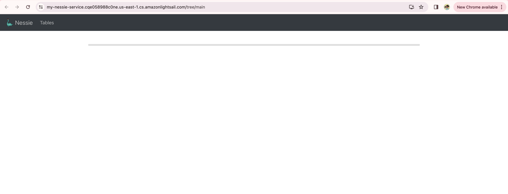
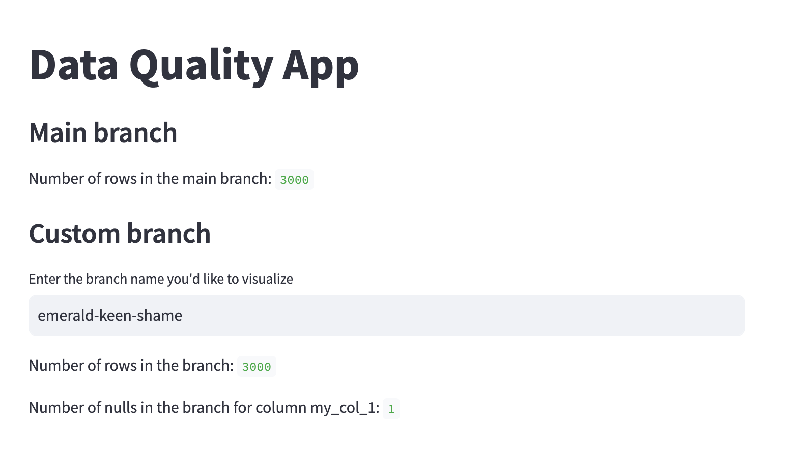

# Write-Audit-Publish on a data lake (no JVM!)

## What on earth is Write-Audit-Publish?

WAP is a pattern designed to use data quality tests to make the data available in a controlled way. Effectively, WAP implements strategies to run tests in a sandboxed environment and avoid that corrupted data becomes available to downstream consumers. As the name suggests, the pattern comprises three main steps:

- **Write** the data being processed to a location inaccessible to downstream consumers. This could include a staging or temporary area, a branch, etc.
- **Audit** the data and run tests to make sure it adhere to predefined quality standards.
- **Publish** the data by writing it to the actual location where downstream consumers can access it.

This repo has a companion [blog post](https://towardsdatascience.com/write-audit-publish-for-data-lakes-in-pure-python-no-jvm-25fbd971b17d) on Towards Data Science, with in-depth discussion about the context for the project and the general lakehouse landscape: reach out if anything rings a bell!
 
## Project overview 
We aim to provide a no-nonsense, reference implementation for Write-Audit-Publish (WAP) patterns on a data lake, using Iceberg as an open table format, and Nessie to leverage git-like semantics of the data catalog.

The git-like semantics provided by Nessie is a good abstraction to implement WAP because of the built-in zero-copy branching of the data lake. Most importantly, using PyIceberg and PyNessie, we will achieve all this without fiddling with the JVM: the project, including the integrated applications can run entirely within a Python interpreter. You're welcome.

Because PyIceberg is fairly new, there is a good chance that this could be the first implementation of a data lake catalog supporting branches that dispenses with the JVM altogether when writing new data into existing Iceberg tables. This repo illustrates a simple case where we deal with one table at the time, but of course it is easy to see how things can quickly become more complex and involve multistep pipelines. The choice of using Nessie depends on the fact that we find the abstraction intuitive when it comes to pipelines (as we detailed [elsewhere](https://arxiv.org/abs/2308.05368)).

We are going to use the following components: 

- Storage: [AWS S3](https://aws.amazon.com/s3/)
- Open table format: [Apache Iceberg](https://iceberg.apache.org/)
- Data catalog: [Project Nessie](https://projectnessie.org/) 
- Code implementation: [PyIceberg](https://py.iceberg.apache.org/)
- Serverless runtime: [Lambda](https://aws.amazon.com/lambda/)
- Virtual private server: [Lightsail](https://aws.amazon.com/lightsail/)
- Alerting system: [Slack](https://slack.com/)

The Slack integration is optional, but it's very easy to set up. 

## The workflow
This project simulates a WAP implementation for a batch ingestion process with the following flow: 

- Some data in parquet format is loaded on an object store location.
- When new data is loaded into the first object store location, a serverless application is triggered and runs on a Lambda. 
- The serverless application interacts with a Nessie catalog through a Lightsail endpoint, and creates a new branch of the catalog to append the new rows in the parquet file.
- The lambda performs a simple data quality test, i.e. checking whether a certain column in the input table contains null values. 
- If the test is passed, the branch is merged into main through the data catalog.
- If the test fails, the branch remains open and the lambda can optionally send an alert on Slack.


  
One of the main advantages of using open table formats like Iceberg is that they are essentially interoperable, which lies at the heart of the [Lakehouse](https://www.databricks.com/sites/default/files/2020/12/cidr_lakehouse.pdf) architecture. To this extent, we provide two examples of downstream applications: 

- A [Streamlit](https://streamlit.io/) app with a dashboard to monitor data quality across different branches.
- An integration with [Snowflake](https://www.snowflake.com/en/) to query the Iceberg tables created. 

The Snowflake integration is optional, and it is frankly tedious to set up. However, it is probably the most interesting integration from an architectural point of view. Ideally, one can use this design to move _outside the warehouse_ some of the computation required for testing, data quality, or low-level ETL, while still maintaining the possibility of taking advantage of Snowflake for querying certified artifacts.

Note that the project is not intended to be a production-ready solution, but rather a reference implementation that can be used as a starting point for more complex scenarios: the code is verbose and heavily commented, making it easy to modify and extend the basic concepts to better suit your use cases.

If you have feedback, wish to contribute or want help with your own data lake setup, please do reach out to us at `info at bauplanlabs dot com`. 


## Setup

### Prerequisites

The intent of this project is mostly pedagogical, so dependencies and frameworks have been kept to a minimum:

* AWS credentials with appropriate permissions when the local scripts run (create buckets, upload files to bucket, create Lightsail service);
* [Serverless](https://www.serverless.com/framework/) to deploy the lambda with one command;
* [Docker](https://www.docker.com/) installed locally to build the container for the lambda.
* BONUS: A Slack account and a [Slack App token](https://api.slack.com/authentication/token-types), if you wish to receive failure notifications; 
* BONUS: a Snowflake account, if you wish to query the post-ETL table.

### Installation

#### Local environment
Prepare a Python virtual environment and install the dependencies in the file `requirements.txt`:

```bash
python3 -m venv venv
source venv/bin/activate
pip install -r requirements.txt
```

Then go into the folder `src/serverless`, copy the content of the file `local.env` into a file `.env`, and fill the values for the two buckets: 
- `SOURCE_BUCKET` is the name of the bucket simulating the ingestion of the raw data; 
- `LAKE_BUCKET` is the destination bucket which will be connected to the Nessie catalog and will contain data in Iceberg format. 
- `SLACK_TOKEN` and `SLACK_CHANNEL` are needed if you wish to send failure notifications to Slack. You can get an App Token for a Bot by creating a new Slack App in your Slack workspace. Please, follow the [tutorial] (https://api.slack.com/tutorials/tracks/getting-a-token) to set up a Slack app that can be used to send alert messages. If you don't want to use Slack as a notification channel, leave this variable empty and the lambda will not attempt to send notifications.
- `NESSIE_ENDPOINT` is the URL of the Nessie service that will be deployed using Amazon lightsail. Leave it empty for now and we will fill it in the next section.

#### Set up S3 and Nessie

Once the S3 fields in your `.env` file have been filled, you can run the script `setup_aws.py` to create the S3 buckets in your AWs account and to deploy a Nessie server as a Lightsail service. To create the Nessie server you will need to pass two arguments in the terminal: `-v` which will define the action to execute, in this case `create` and `-n` which will define the name of the container service (note that underscores are not allowed, you need to use hyphens):

```shell
cd src
python setup_aws.py -v=create -n=nessie-service
```

Running the script should print in the terminal the URL of your freshly deployed Nessie service. Now, copy the URL, go back to your `.env` file and paste it as the value for `NESSIE_ENDPOINT`. Before continuing, go in the Lightsail console and make sure that the service has been deployed and the endpoint is up and running. It might take a few minutes, so be patient. At the end you should be able to access your Nessie UI from the public domain provided in your Lightsail deployment.



We assume that you are pointing at your `default` AWS profile and that your user has the necessary permissions to create interact with S3. If you want to run this project using another AWS profile of yours, you can just export your profile as a global variable in your terminal (for more on this see [AWS guide](https://docs.aws.amazon.com/cli/latest/userguide/cli-configure-files.html#cli-configure-files-using-profiles))

```shell
export AWS_PROFILE=<your_profile>
```

#### AWS Lambda

The lambda app is deployed through the Serverless framework, so make sure it's installed via npm:

```shell
npm install -g serverless
```

If you don’t already have `Node.js` on your machine, you need to install it [first](https://www.serverless.com/framework/docs/getting-started).

To deploy the lambda, run:

```shell
cd src/serverless
serverless deploy
```
With this you should be done with the setup.

## Run the project

To run the project, cd into `src` and run:

```shell
cd src
python data_loader.py --no-null -n 1000 --verbose
```

This will trigger the following flow:

- A synthetic dataset of 1000 rows is created as a parquet file with the following schema: 

```
my_col_0: int32
my_col_1: string
my_col_2: double
```

- The file is uploaded on AWS S3 to your `SOURCE_BUCKET`.
- The Lambda application is then triggered, creates an upload branch in the Nessie catalog and writes the data into an Iceberg table in it.
- An expectation quality test is performed to check whether the values of the column `my_col_1` include some NULLs.
- Because we passed the flag `--no-null` when the script was launched, the generated dataset will contain no null values, causing the test to pass.
- The branch is merged back in the `main` branch of the data catalog.

Now, you can simulate what would happen in the WAP pattern, if the data uploaded did not pass the expectation test To do that, simply remove the flag `--no-null`:

```shell
python data_loader.py -n 1000 --verbose
```

This will trigger the same flow as before, but it will produce rows with NULL value in them, causing the quality check to fail. As a consequence, the upload branch won't be merged, and it will remain visible in Nessie UI. If you have set up Slack variables in your `.env` file, you should receive a message with the error and the name of the upload branch in the specified channel:


You can use this template to customize the data upload with the data that you prefer and implement different quality tests depending on your need.

## Data quality app
To monitor the WAP process you can use a simple visualization app included in this project.

```python
streamlit run quality_app.py
```

Open the browser at the URL provided by Streamlit to see a dashboard showing the total number of rows in `main` (every time you run the loader with no errors, the number will go up!).

If you want to see what is happening on those branches that failed to pass the expectation test, you can copy the name of a branch from your Nessie UI (or from the Slack alert message, if you set up Slack) and pasted in the Streamlit app.
The dashboard will show you how many NULLs are in the branch you specified, giving you visibility on what ultimately caused the WAP flow to fail.




## Bonus: querying the final table with Snowflake

A consequence of using Iceberg tables for ingestion and ETL is that we can move out of the warehouse expensive computation run for data quality checks and still leverage the warehouse for querying the final, certified data. In this bonus section, we show how to query the final table in Snowflake.
Setting up Snowflake to query the table we created in the data lake is quite cumbersome but not hard: unfortunately, it is a manual process going back and forth between AWS IAM roles and Snowflake instructions. 

There are three steps:

### 1. Set up an external volume
First, you'll need to configure your data lake as an [external volume in Snowflake](https://docs.snowflake.com/en/user-guide/tables-iceberg-configure-external-volume)
This process involved setting up the IAM role and permissions needed to add your S3 data lake as an external volume. You can skip the part on encryption. 

### 2. Configure an external Iceberg catalog
Second, you'll need to configure an external catalog for Iceberg tables. To do that follow the first part of the Snowflake guide [here](https://docs.snowflake.com/en/user-guide/tables-iceberg-configure-catalog-integration).

### 3. Create an Iceberg table from your data lake
Third, you'll need to [create a Snowflake table from Iceberg metadata](https://docs.snowflake.com/en/user-guide/tables-iceberg-create#label-tables-iceberg-create-catalog-int). This s a no-op, only involving metadata.
 
Follow the instructions in the Snowflake guide to `Create an Iceberg table from Iceberg files in object storage`. You will need to check the current metadata file associated with the table in the `main` branch in [Nessie](images/nessie_metadata.png) and use the `METADATA_FILE_PATH` to create the table in Snowflake.

```sql
CREATE ICEBERG TABLE customer_cleaned_data
  EXTERNAL_VOLUME='icebergwapvolume'
  CATALOG='myWapInt'
  METADATA_FILE_PATH='metadata/0000xxx-xxxx-xxxxx.metadata.json';
```

In this case, we are creating a Snowflake external table called `CUSTOMER_CLEANED_DATA` that represents the rows in our ingestion table after they have been certified by our WAP process. If you run this project from scratch twice, you will have to change that in your Snowflake code and run it again (as the metadata link in Iceberg would change).

### Query and explore data
Finally, you can run an arbitrary query in a Snowflake SQL worksheet. For instance: 

```sql
SELECT SUM(MY_COL_0), AVG(MY_COL_2), COUNT(*) AS TOT_ROWS FROM CUSTOMER_CLEANED_DATA;
```

Of course, now that the volume and the external catalog are set up, we could leverage the Snowflake Python connector to automatically create (in the lambda) the table from the metadata file after every merge (by reading the metadata from PyIceberg after WAP is completed).

We leave this as an exercise to the reader!

## License

We provide the code as a reference, pedagogical implementation of the Write-Audit-Publish pattern on a data lake, using entirely Python in the business logic and AWS services for the infrastructure. The code is provided as-is, with no warranties or guarantees of any kind and it's licensed under the MIT License. Feel free to use it, modify it, extend it, but please provide attribution to the original authors.

